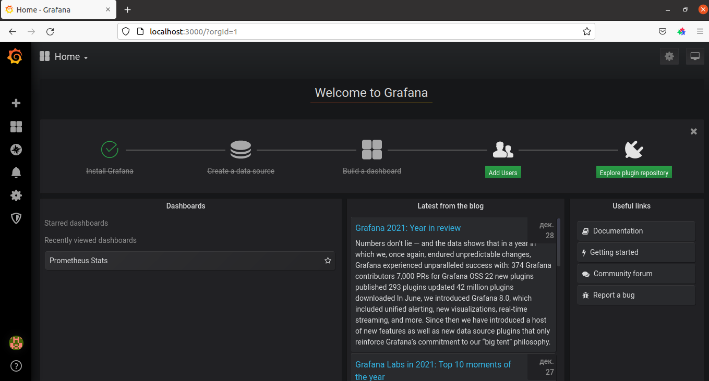
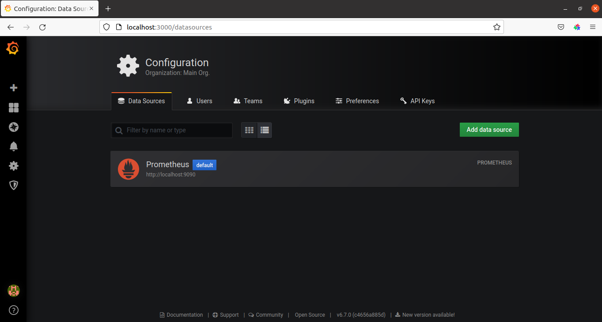
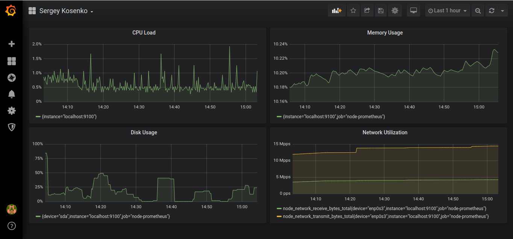

# **Введение**

Цель данной лабораторной работы получить навыки работы с инструментами мониторинга.

## Описание ##

Лабораторная работа будет проводиться с системой мониторинга Prometheus.

Cтенд был скопирован с ресурса https://github.com/viveksatasiya/vagrant-prometheus-grafana

При старте стенда на виртуальную машину с операционной системой Ubuntu 18.04.6 устанавливается Prometheus, Node-Exporter и Grafana.

Запустим нужные нам сервисы:

```
vagrant@ubuntu-bionic: cd /home/vagrant/Prometheus/node_exporter/node_exporter-1.0.1.linux-amd64/
vagrant@ubuntu-bionic: sudo ./node_exporter &

vagrant@ubuntu-bionic: cd /home/vagrant/Prometheus/server/prometheus-2.21.0.linux-amd64/
vagrant@ubuntu-bionic: sudo ./prometheus &

vagrant@ubuntu-bionic: sudo systemctl start grafana-server
```

Перейдём по адресу 'http://localhost:3000':




Добавим источник данных:




Теперь создадим дашборд с требуемыми графиками:

- процессор;
- память;
- диск;
- сеть.




Запросы, использованные для построения графиков:

```
CPU Load:

100 - (avg by (instance) (irate(node_cpu_seconds_total{job="node-prometheus",mode="idle"}[5m])) * 100)
```

```
Memory Usage:

100 * (1 - ((avg_over_time(node_memory_MemFree_bytes[1m]) + avg_over_time(node_memory_Cached_bytes[1m]) + avg_over_time(node_memory_Buffers_bytes[1m])) / avg_over_time(node_memory_MemTotal_bytes[1m])))
```

```
Disk Usage:

rate(node_disk_io_time_seconds_total{device="sda"}[5m])*100000
```

```
Network Utilization:

{job="node-prometheus",device="enp0s3",__name__ =~"node_network_.*_bytes_total"}
```