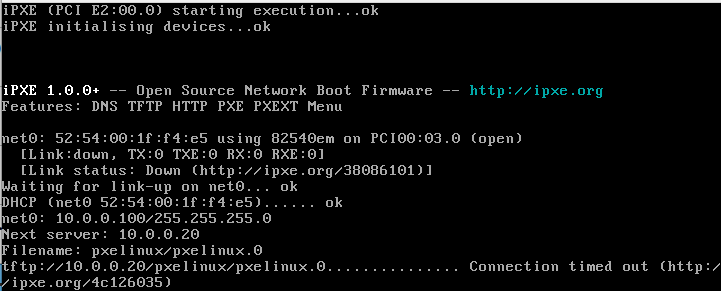
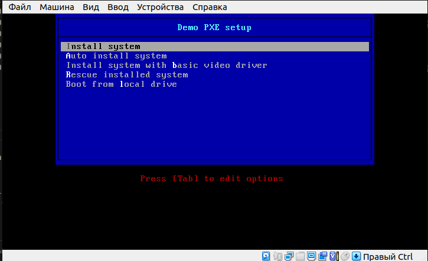
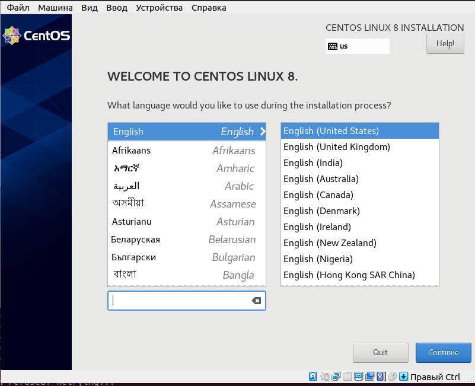
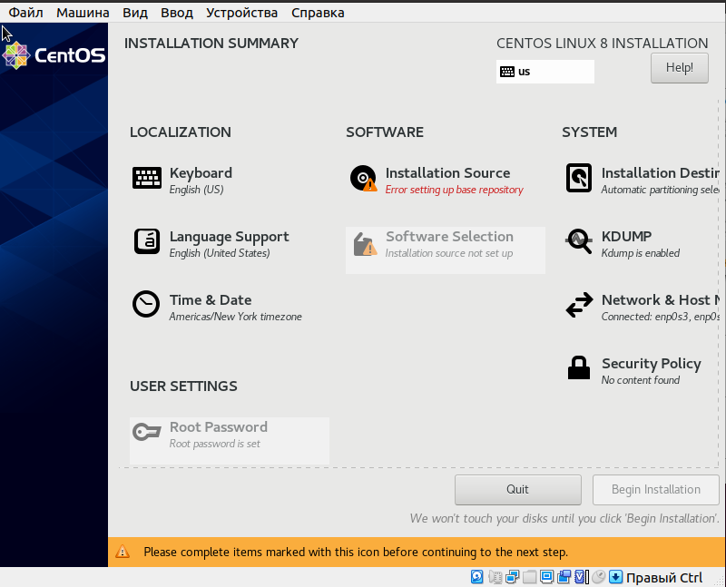

# **Введение** #

Цель данной лабораторной работы получить навыки установки и настройки DHCP, TFTP, PXE загрузчика и автоматической загрузки.

## **Описание** ##

Стенд состоит из двух серверов 'pxeserver' с ОС Centos 8.2 и 'pxeclient' также с ОС Centos 8.2. После старта стенда настройка осуществляется с помощью Ansible.

!!! ВНИМАНИЕ !!! При запуске стенда происходит закачка установочного образа, большой объём, порядка 800Mb

Для отключения закомментировать блок в 'provision.yml':

```
...
 - name: Download CentOS installation image file
    get_url:
      url: http://mirror.reconn.ru/centos/{{ os_version }}/BaseOS/x86_64/os/images/boot.iso
      dest: /home/vagrant/boot.iso
...

```

## **DHCP** ##

DHCP сервис устанавливается на сервер pxeserver и нужен для выдачи IP адреса клиенту для подключения к серверу TFTP. Конфигурация DHCP сервиса описана в файле dhcpd.conf.

## **TFTP** ##

При получении IP адреса клиент также получает информацию о tftp сервере и файлах pxelinux, которые нужно загрузить с этого tftp сервера. Файлы pxelinux мы получаем установив пакет 'syslinux-tftpboot.noarch'. Файл меню загрузки также загружается клиенту с tftp сервера. Меню загрузки описано в файле 'default' и находится в каталоге '/var/lib/tftpboot/pxelinux/pxelinux.cfg'. На tftp сервер также выкладываюся образы загрузки vmlinuz и initrd.img 

## **PXE загрузка** ##

После запуска стенда на pxeserver устанавливаются необходимые пакеты, файлы и запускаются службы DHCP и TFTP
Для проверки загрузки клиента откроем окно VirtualBox и при запуске клиента выберем загрузку по сети.

Клиент получает адрес и настройки с DHCP сервера:

```
Dec 05 09:50:32 pxeserver dhcpd[723]: Server starting service.
Dec 05 09:50:32 pxeserver systemd[1]: Started DHCPv4 Server Daemon.
Dec 05 09:52:47 pxeserver dhcpd[723]: DHCPDISCOVER from 52:54:00:1f:f4:e5 via eth1
Dec 05 09:52:48 pxeserver dhcpd[723]: DHCPOFFER on 10.0.0.100 to 52:54:00:1f:f4:e5 via eth1
Dec 05 09:52:50 pxeserver dhcpd[723]: DHCPREQUEST for 10.0.0.100 (10.0.0.20) from 52:54:00:1f:f4:e5 via eth1
Dec 05 09:52:50 pxeserver dhcpd[723]: DHCPACK on 10.0.0.100 to 52:54:00:1f:f4:e5 via eth1
...
```
На клиенте посмотрим загрузку (tftp сервер в данный момент недоступен)




Запустим tftp сервис и повторим загрузку.

В логах сервера можем видеть как клиент получает файлы с tftp сервера:

```
sudo tail -f /var/log/messages 
Dec  5 10:02:31 pxeserver dhcpd[723]: DHCPOFFER on 10.0.0.100 to 52:54:00:1f:f4:e5 via eth1
Dec  5 10:02:33 pxeserver dhcpd[723]: DHCPREQUEST for 10.0.0.100 (10.0.0.20) from 52:54:00:1f:f4:e5 via eth1
Dec  5 10:02:33 pxeserver dhcpd[723]: DHCPACK on 10.0.0.100 to 52:54:00:1f:f4:e5 via eth1
Dec  5 10:02:33 pxeserver in.tftpd[3378]: Client ::ffff:10.0.0.100 finished pxelinux/pxelinux.0
Dec  5 10:02:33 pxeserver in.tftpd[3379]: Client ::ffff:10.0.0.100 finished pxelinux/ldlinux.c32
Dec  5 10:02:33 pxeserver in.tftpd[3390]: Client ::ffff:10.0.0.100 finished pxelinux/pxelinux.cfg/default
Dec  5 10:02:33 pxeserver in.tftpd[3391]: tftp: client does not accept options
Dec  5 10:02:33 pxeserver in.tftpd[3392]: Client ::ffff:10.0.0.100 finished pxelinux/menu.c32
Dec  5 10:02:33 pxeserver in.tftpd[3393]: Client ::ffff:10.0.0.100 finished pxelinux/libutil.c32
Dec  5 10:02:33 pxeserver in.tftpd[3394]: Client ::ffff:10.0.0.100 finished pxelinux/pxelinux.cfg/default
...
```

На клиенте видим меню загрузки:




## **Репозиторий NFS и HTTP** ##

Для установки системы нам нужно разместить установочный образ на репозиторий. Используем для этого nfs сервер.

Образ скачивается при запуске стенда в папку '/home/vagrant/', папка для монтирования образа тоже создаётся при запуске стенда (/mnt/centos-install).

Смонтируем образ ОС, отобразим папку в nfs и запустим сервис:

```
mount -t iso9660 /home/vagrant/boot.iso /mnt/centos-install
echo '/mnt/centos-install *(ro)' > /etc/exports
systemctl start nfs-server
```
Проверим загрузку и установку ОС:



Установочный образ был запущен с nfs.

Разместим образ на HTTP сервере.

Отмонтируем папку /mnt/centos-install, смонтируем её в папку HTTP сервера и запустим http сервер:

```
umount /mnt/centos-install
mount -t iso9660 /home/vagrant/boot.iso /var/www/html/centos-install
systemctl start httpd
```

Заменим строчку в файле меню загрузки '/var/lib/tftpboot/pxelinux/pxelinux.cfg/default':

```
append initrd=images/CentOS-8/initrd.img ip=enp0s3:dhcp inst.repo=nfs:10.0.0.20:/mnt/centos-install
```

на

```
append initrd=images/CentOS-8/initrd.img ip=enp0s3:dhcp inst.repo=http://10.0.0.20/centos-install/
```

Образ был загружен с http сервера.

## **Kickstart** ##

Автоматическая установка описана в файле 'ks.cfg'. Файл копируется в папку /var/www/html/cfg.

Файл доступен для загрузки на клиент по протоколу http. Это указано в секции файла 'default', параметр 'inst.ks':

```
LABEL linux-auto
  menu label ^Auto install system
  kernel images/CentOS-8/vmlinuz
  append initrd=images/CentOS-8/initrd.img ip=enp0s3:dhcp inst.ks=http://10.0.0.20/cfg/ks.cfg inst.repo=http://10.0.0.20/centos-install/
```

Выбор в загрузочном меню пункта "Auto install system" загружает установочный образ с файлом ks.cfg и после загрузки мы сразу же попадаем на страницу "INSTALLATION SUMMARY":

