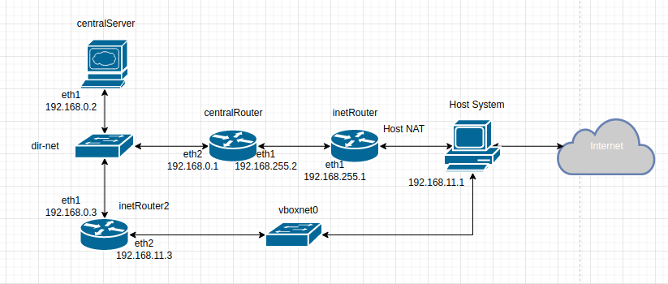
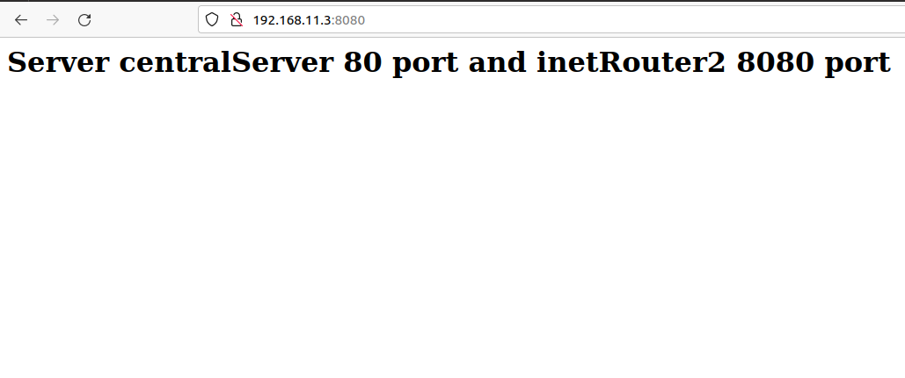

# **Введение** #

Цель данной лабораторной работы на практике ознакомиться с инструментами управления firewall, NAT, пробросом портов. 

## **Описание** ##

Стенд состоит из трёх серверов с ОС Centos 7:

- 'inetRouter'
- 'centralRouter'
- 'centralServer'

В процессе выполнения работы добавляется ещё один сервер, inetRouter2, который имеет интерфейс, видимый с хоста (тип сети host-only). Подключение серверов выполнено соглано схемы ниже:



## **Knocking port** ##

Согласно условиям безопасности, centralRouter может попасть по ssh на inetRouter через knocking port.

Настройки iptables описаны в файле iptables.rules, который копируется и применяется на inetRouter при старте стенда.

Попробуем подключиться по ssh обычным способом:

```
vagrant@centralRouter ~]$ ssh 192.168.255.1
^C
[vagrant@centralRouter ~]$
```

Подключения нет.

До подключения по ssh запустим скрипт, который копируется на centralRouter при старте стенда в каталог '/home/vagrant'. И попробуем подключиться по ssh:

```
[vagrant@centralRouter ~]$ ./knock.sh 192.168.255.1 8881 7777 9991

Starting Nmap 6.40 ( http://nmap.org ) at 2021-12-13 12:01 UTC
Warning: 192.168.255.1 giving up on port because retransmission cap hit (0).
Nmap scan report for 192.168.255.1
Host is up (0.00036s latency).
PORT     STATE    SERVICE
8881/tcp filtered unknown
MAC Address: 08:00:27:C6:68:42 (Cadmus Computer Systems)

Nmap done: 1 IP address (1 host up) scanned in 0.38 seconds

Starting Nmap 6.40 ( http://nmap.org ) at 2021-12-13 12:01 UTC
Warning: 192.168.255.1 giving up on port because retransmission cap hit (0).
Nmap scan report for 192.168.255.1
Host is up (0.00044s latency).
PORT     STATE    SERVICE
7777/tcp filtered cbt
MAC Address: 08:00:27:C6:68:42 (Cadmus Computer Systems)

Nmap done: 1 IP address (1 host up) scanned in 0.39 seconds

Starting Nmap 6.40 ( http://nmap.org ) at 2021-12-13 12:01 UTC
Warning: 192.168.255.1 giving up on port because retransmission cap hit (0).
Nmap scan report for 192.168.255.1
Host is up (0.00040s latency).
PORT     STATE    SERVICE
9991/tcp filtered issa
MAC Address: 08:00:27:C6:68:42 (Cadmus Computer Systems)

Nmap done: 1 IP address (1 host up) scanned in 0.37 seconds

[vagrant@centralRouter ~]$ssh 192.168.255.1
vagrant@192.168.255.1's password: 
Last login: Mon Dec 13 08:26:07 2021 from 192.168.255.2
[vagrant@inetRouter ~]$
```

Успешно подключились через ssh на inteRouter по паролю 'vagrant'. 

## **Проброс порта 80 centralServer на порт 8080 inetRouter2.** ##

Nginx устанавливается на centralServer при старте стенда. Проверим доступность сервиса на порту 80 с inetRouter2 и centralRouter:

```
[vagrant@centralRouter ~]$ curl 192.168.0.2
<h1>Server centralServer 80 port and inetRouter2 8080 port</h1>
[vagrant@centralRouter ~]$ 

[vagrant@inetRouter2 ~]$ curl 192.168.0.2
<h1>Server centralServer 80 port and inetRouter2 8080 port</h1>
[vagrant@inetRouter2 ~]$
```

С хостовой машины интерфейс роутера inetRouter2 доступен, но сервис на порту 8080 недоступен:

```
ping 192.168.11.3
PING 192.168.11.3 (192.168.11.3) 56(84) bytes of data.
64 bytes from 192.168.11.3: icmp_seq=1 ttl=64 time=0.632 ms
64 bytes from 192.168.11.3: icmp_seq=2 ttl=64 time=0.681 ms
....

curl 192.168.11.3:8080
curl: (7) Failed to connect to 192.168.11.3 port 8080: В соединении отказано
```

Пробросим порт 8080 интерфейса 192.168.11.3 роутера inetRouter2 на порт 80 сервера centralServer (данная команда применяется при старте стенда):

```
[vagrant@inetRouter2 ~]$ sudo firewall-cmd --add-forward-port=port=8080:proto=tcp:toport=80:toaddr=192.168.0.2
```

```
curl 192.168.11.3:8080
<h1>Server centralServer 80 port and inetRouter2 8080 port</h1>
```

Сервис доступен. Откроем страницу в браузере:



