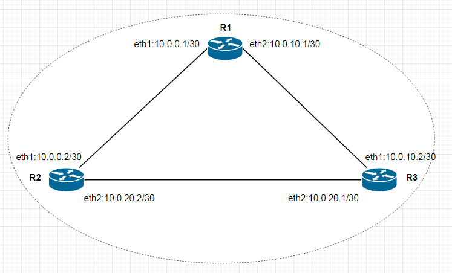

# **Введение** #

Цель данной лабораторной работы на практике сравнить принципы работы статической и динамической маршрутизацией, получить навыки настройки программных маршрутизаторов.

## **Описание** ##

Стенд состоит из трёх серверов с ОС Centos 7:

- 'router1'
- 'router2'
- 'router3'

У каждого сервера по два интерфейса, при запуске устанавливается програмный маршрутизатор FRR и настраивается протокол динамической маршрутизации OSPF. Интерфейсы серверов соединены соглано схемы ниже:



## **Запуск стенда** ##

После запуска стенда проверим маршруты и доступность интерфейсов маршрутизаторов.

Подключимся на router1, запустим консоль frr и проверим маршрутизацию пакетов:

```
router1# sh ip route
Codes: K - kernel route, C - connected, S - static, R - RIP,
       O - OSPF, I - IS-IS, B - BGP, E - EIGRP, N - NHRP,
       T - Table, A - Babel, F - PBR, f - OpenFabric,
       > - selected route, * - FIB route, q - queued, r - rejected, b - backup
       t - trapped, o - offload failure

K>* 0.0.0.0/0 [0/100] via 10.0.2.2, eth0, 00:36:38
O   10.0.0.0/30 [110/100] is directly connected, eth1, weight 1, 00:36:38
C>* 10.0.0.0/30 is directly connected, eth1, 00:36:38
C>* 10.0.2.0/24 is directly connected, eth0, 00:36:38
O   10.0.10.0/30 [110/100] is directly connected, eth2, weight 1, 00:31:20
C>* 10.0.10.0/30 is directly connected, eth2, 00:36:38
O>* 10.0.20.0/30 [110/200] via 10.0.0.2, eth1, weight 1, 00:31:08
  *                        via 10.0.10.2, eth2, weight 1, 00:31:08

router1# ping 10.0.20.2
PING 10.0.20.2 (10.0.20.2) 56(84) bytes of data.
64 bytes from 10.0.20.2: icmp_seq=1 ttl=64 time=0.642 ms
64 bytes from 10.0.20.2: icmp_seq=2 ttl=64 time=1.00 ms
^C
--- 10.0.20.2 ping statistics ---
4 packets transmitted, 4 received, 0% packet loss, time 3006ms
rtt min/avg/max/mdev = 0.642/0.920/1.072/0.168 ms
router1# traceroute 10.0.20.2
traceroute to 10.0.20.2 (10.0.20.2), 30 hops max, 60 byte packets
 1  10.0.20.2 (10.0.20.2)  0.664 ms  0.544 ms  0.306 ms
router1# 
```
Из вывода видно, что в данный момент с роутера R1, интерфейс eth2(10.0.20.2) маршрутизатора R2, доступен через интерфейс eth1(10.0.0.2). Traceroute подтверждает данный маршрут.

Интерфейс eth2(10.0.20.1) маршрутизатора R3 также достигается данным маршрутом:

```
router1# traceroute 10.0.20.1
traceroute to 10.0.20.1 (10.0.20.1), 30 hops max, 60 byte packets
 1  10.0.0.2 (10.0.0.2)  0.834 ms  0.585 ms  0.288 ms
 2  10.0.20.1 (10.0.20.1)  1.028 ms  1.016 ms  1.272 ms
router1# 
```

Разорвём соединение маршрутизаторов R2-R3:


```
[root@router2 ~]# ip link set eth2 down
```

Проверим маршруты и доступность тех же интерфейсов:

```
router1# sh ip route
Codes: K - kernel route, C - connected, S - static, R - RIP,
       O - OSPF, I - IS-IS, B - BGP, E - EIGRP, N - NHRP,
       T - Table, A - Babel, F - PBR, f - OpenFabric,
       > - selected route, * - FIB route, q - queued, r - rejected, b - backup
       t - trapped, o - offload failure

K>* 0.0.0.0/0 [0/100] via 10.0.2.2, eth0, 00:50:41
O   10.0.0.0/30 [110/100] is directly connected, eth1, weight 1, 00:09:32
C>* 10.0.0.0/30 is directly connected, eth1, 00:50:41
C>* 10.0.2.0/24 is directly connected, eth0, 00:50:41
O   10.0.10.0/30 [110/100] is directly connected, eth2, weight 1, 00:45:23
C>* 10.0.10.0/30 is directly connected, eth2, 00:50:41
O>* 10.0.20.0/30 [110/200] via 10.0.10.2, eth2, weight 1, 00:00:08
```
Маршрут к сети 10.0.20.0/30 через 10.0.0.2 (R2) пропал из таблицы маршрутизации роутера R1

```
router1# ping 10.0.20.2
PING 10.0.20.2 (10.0.20.2) 56(84) bytes of data.
From 10.0.10.2 icmp_seq=1 Destination Host Unreachable
```

Интерфейс R2 недоступен - мы его выключили.

```
PING 10.0.20.1 (10.0.20.1) 56(84) bytes of data.
64 bytes from 10.0.20.1: icmp_seq=1 ttl=64 time=0.682 ms
64 bytes from 10.0.20.1: icmp_seq=2 ttl=64 time=1.16 ms
^C
--- 10.0.20.1 ping statistics ---
3 packets transmitted, 3 received, 0% packet loss, time 2013ms
rtt min/avg/max/mdev = 0.682/0.908/1.168/0.201 ms
router1# traceroute 10.0.20.1
traceroute to 10.0.20.1 (10.0.20.1), 30 hops max, 60 byte packets
 1  10.0.20.1 (10.0.20.1)  0.404 ms  0.460 ms  0.439 ms
router1# 

```
Интерфейс eth2(10.0.20.1) маршрутизатора R3 теперь доступен через интерфейс eth2(10.0.10.1)

## **Изменение "стоимости" линка и симметричный роутинг** ##

Увеличим стоимость линка на интерфейсе eth1(10.0.0.1) роутера R1 и добьёмся маршрутизации пакетов в сеть 10.0.20.0/30 через роутер R3:

```
router1(config-if)# ip ospf cost 1000
router1(config-if)# do sh ip route
Codes: K - kernel route, C - connected, S - static, R - RIP,
       O - OSPF, I - IS-IS, B - BGP, E - EIGRP, N - NHRP,
       T - Table, A - Babel, F - PBR, f - OpenFabric,
       > - selected route, * - FIB route, q - queued, r - rejected, b - backup
       t - trapped, o - offload failure

K>* 0.0.0.0/0 [0/100] via 10.0.2.2, eth0, 01:54:09
O   10.0.0.0/30 [110/300] via 10.0.10.2, eth2, weight 1, 00:00:12
C>* 10.0.0.0/30 is directly connected, eth1, 01:54:09
C>* 10.0.2.0/24 is directly connected, eth0, 01:54:09
O   10.0.10.0/30 [110/100] is directly connected, eth2, weight 1, 01:48:51
C>* 10.0.10.0/30 is directly connected, eth2, 01:54:09
O>* 10.0.20.0/30 [110/200] via 10.0.10.2, eth2, weight 1, 00:00:12
router1(config-if)#

router1# traceroute 10.0.20.1
traceroute to 10.0.20.1 (10.0.20.1), 30 hops max, 60 byte packets
 1  10.0.20.1 (10.0.20.1)  0.803 ms  0.605 ms  0.582 ms
router1# traceroute 10.0.20.2
traceroute to 10.0.20.2 (10.0.20.2), 30 hops max, 60 byte packets
 1  10.0.10.2 (10.0.10.2)  0.697 ms  0.526 ms  0.401 ms
 2  10.0.20.2 (10.0.20.2)  1.302 ms  1.075 ms  1.100 ms
router1#
```

## **Изменение "стоимости" линков и ассиметричный роутинг** ##

Теперь увеличим стоимость линка на интерфейсе eth2(10.0.20.2) роутера R2. Этим мы указываем маршрутизатору использовать интерфейс eth1 для отправки пакетов в сеть 10.0.10.0/30:

```
router1# ping 10.0.20.2
PING 10.0.20.2 (10.0.20.2) 56(84) bytes of data.
64 bytes from 10.0.20.2: icmp_seq=1 ttl=63 time=0.815 ms
64 bytes from 10.0.20.2: icmp_seq=2 ttl=63 time=2.08 ms
64 bytes from 10.0.20.2: icmp_seq=3 ttl=63 time=1.97 ms
64 bytes from 10.0.20.2: icmp_seq=4 ttl=63 time=1.73 ms
^C
--- 10.0.20.2 ping statistics ---
4 packets transmitted, 4 received, 0% packet loss, time 3016ms
rtt min/avg/max/mdev = 0.815/1.653/2.088/0.502 ms

router2(config-if)# ip ospf cost 1000

router1# ping 10.0.20.2
PING 10.0.20.2 (10.0.20.2) 56(84) bytes of data.
^C
--- 10.0.20.2 ping statistics ---
7 packets transmitted, 0 received, 100% packet loss, time 6009ms

router1# 
```

Видим, что пакеты от маршрутизатора R1 приходят на интерфейс eth2 маршрутизатора R2:

```
[root@router2 ~]# tcpdump -ieth2 icmp
tcpdump: verbose output suppressed, use -v or -vv for full protocol decode
listening on eth2, link-type EN10MB (Ethernet), capture size 262144 bytes
10:31:32.510780 IP 10.0.10.1 > router2: ICMP echo request, id 30773, seq 347, length 64
10:31:33.510610 IP 10.0.10.1 > router2: ICMP echo request, id 30773, seq 348, length 64
10:31:34.511016 IP 10.0.10.1 > router2: ICMP echo request, id 30773, seq 349, length 64
10:31:35.510848 IP 10.0.10.1 > router2: ICMP echo request, id 30773, seq 350, length 64
....
```

Ping пропал потому, что маршрутизатор получает пакеты на одном интерфейсе, а ответы должен слать через другой, что и называется ассиметричный роутинг. По умолчанию в ядре Linux включена "строгая" проверка на всех интерфейсах. Изменим настройку на маршрутизаторах R1(шлёт icmp) и R2(отвечает на icmp):

```
[root@router1 ~]# sysctl -w net.ipv4.conf.eth{1,2}.rp_filter=0
net.ipv4.conf.eth1.rp_filter = 0
net.ipv4.conf.eth2.rp_filter = 0

[root@router2 ~]# sysctl -w net.ipv4.conf.eth{1,2}.rp_filter=0
net.ipv4.conf.eth1.rp_filter = 0
net.ipv4.conf.eth2.rp_filter = 0
```

И запустим ping ещё раз:

```
[root@router1 ~]# ping 10.0.20.2
PING 10.0.20.2 (10.0.20.2) 56(84) bytes of data.
64 bytes from 10.0.20.2: icmp_seq=1 ttl=64 time=0.672 ms
64 bytes from 10.0.20.2: icmp_seq=2 ttl=64 time=1.47 ms
64 bytes from 10.0.20.2: icmp_seq=3 ttl=64 time=1.33 ms
64 bytes from 10.0.20.2: icmp_seq=4 ttl=64 time=1.31 ms
^C
--- 10.0.20.2 ping statistics ---
4 packets transmitted, 4 received, 0% packet loss, time 3011ms
rtt min/avg/max/mdev = 0.672/1.198/1.470/0.310 ms
```

Из вывода tcpdump на маршрутизаторе R2 видно, что пакеты приходят на один интерфейс, а ответы отправляются с другого (разные MAC адреса):

```
[root@router2 ~]# tcpdump -ei any icmp
tcpdump: verbose output suppressed, use -v or -vv for full protocol decode
listening on any, link-type LINUX_SLL (Linux cooked), capture size 262144 bytes
11:39:39.847886  In 08:00:27:ea:3a:50 (oui Unknown) ethertype IPv4 (0x0800), length 100: 10.0.10.1 > router2: ICMP echo request, id 1932, seq 1, length 64
11:39:39.847960 Out 08:00:27:48:ac:00 (oui Unknown) ethertype IPv4 (0x0800), length 100: router2 > 10.0.10.1: ICMP echo reply, id 1932, seq 1, length 64
11:39:40.849932  In 08:00:27:ea:3a:50 (oui Unknown) ethertype IPv4 (0x0800), length 100: 10.0.10.1 > router2: ICMP echo request, id 1932, seq 2, length 64
11:39:40.850001 Out 08:00:27:48:ac:00 (oui Unknown) ethertype IPv4 (0x0800), length 100: router2 > 10.0.10.1: ICMP echo reply, id 1932, seq 2, length 64
11:39:41.854297  In 08:00:27:ea:3a:50 (oui Unknown) ethertype IPv4 (0x0800), length 100: 10.0.10.1 > router2: ICMP echo request, id 1932, seq 3, length 64
11:39:41.854367 Out 08:00:27:48:ac:00 (oui Unknown) ethertype IPv4 (0x0800), length 100: router2 > 10.0.10.1: ICMP echo reply, id 1932, seq 3, length 64
```
