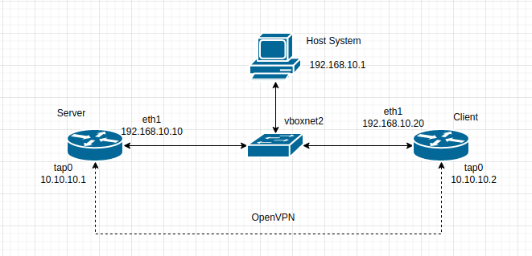

# **Введение** #

Цель данной лабораторной работы на практике разобраться в терминологии различных технологий VPN, настроить VPN сервер, проверить работу в различных режимах.


## **Описание** ##

Стенд состоит из двух серверов с ОС Centos 7:

- 'server'
- 'client'

Так же в проверке настройки VPN сервера принимает участие хостовая машина. Подключение серверов выполнено соглано схемы ниже:



## **TUN/TAP режимы VPN** ##

Установка необходимых нам пакетов осуществляется при старте стенда. Копирование конфигурационных файлов и запуск сервисов производится так же при запуске стенда.

Проверим доступность сервера (10.10.10.1) и клиента (10.10.10.2)

```
[vagrant@client ~]$ ip -bri a
lo               UNKNOWN        127.0.0.1/8 ::1/128 
eth0             UP             10.0.2.15/24 fe80::5054:ff:fe4d:77d3/64 
eth1             UP             192.168.10.20/24 fe80::a00:27ff:fefe:3b22/64 
tap0             UNKNOWN        10.10.10.2/24 fe80::7c3a:3ff:fe6c:cbd2/64 
[vagrant@client ~]$ ping 10.10.10.1
PING 10.10.10.1 (10.10.10.1) 56(84) bytes of data.
64 bytes from 10.10.10.1: icmp_seq=1 ttl=64 time=1.38 ms
64 bytes from 10.10.10.1: icmp_seq=2 ttl=64 time=1.65 ms
64 bytes from 10.10.10.1: icmp_seq=3 ttl=64 time=1.60 ms
```

```
[vagrant@server ~]$ ip -bri a
lo               UNKNOWN        127.0.0.1/8 ::1/128 
eth0             UP             10.0.2.15/24 fe80::5054:ff:fe4d:77d3/64 
eth1             UP             192.168.10.10/24 fe80::a00:27ff:fefb:fe10/64 
tap0             UNKNOWN        10.10.10.1/24 fe80::8467:12ff:fe77:e8c3/64 
[vagrant@server ~]$ ping 10.10.10.2
PING 10.10.10.2 (10.10.10.2) 56(84) bytes of data.
64 bytes from 10.10.10.2: icmp_seq=1 ttl=64 time=0.824 ms
64 bytes from 10.10.10.2: icmp_seq=2 ttl=64 time=1.48 ms
64 bytes from 10.10.10.2: icmp_seq=3 ttl=64 time=1.45 ms
```

Измерим скорость в туннеле TAP.

Для этого на сервере 'server' запускаем iperf3 в режиме сервера:

```
iperf3 -s &
-----------------------------------------------------------
Server listening on 5201
-----------------------------------------------------------
Accepted connection from 10.10.10.2, port 38474
[  5] local 10.10.10.1 port 5201 connected to 10.10.10.2 port 38476
[ ID] Interval           Transfer     Bandwidth
[  5]   0.00-1.00   sec  9.24 MBytes  77.4 Mbits/sec                  
[  5]   1.00-2.00   sec  9.49 MBytes  79.6 Mbits/sec                  
[  5]   2.00-3.00   sec  8.04 MBytes  67.2 Mbits/sec                  
[  5]   3.00-4.00   sec  11.1 MBytes  93.1 Mbits/sec                  
[  5]   4.00-5.00   sec  10.5 MBytes  88.0 Mbits/sec                  
[  5]   5.00-6.00   sec  10.7 MBytes  89.1 Mbits/sec                  
[  5]   6.00-7.00   sec  10.6 MBytes  89.1 Mbits/sec                  
[  5]   7.00-8.00   sec  10.3 MBytes  86.5 Mbits/sec                  
[  5]   8.00-9.00   sec  10.3 MBytes  86.2 Mbits/sec                  
[  5]   9.00-10.00  sec  10.8 MBytes  90.7 Mbits/sec                  
[  5]  10.00-11.00  sec  10.4 MBytes  87.1 Mbits/sec                  
[  5]  11.00-12.00  sec  10.1 MBytes  84.9 Mbits/sec                  
[  5]  12.00-13.00  sec  10.5 MBytes  88.1 Mbits/sec                  
[  5]  13.00-14.00  sec  10.8 MBytes  90.3 Mbits/sec                  
[  5]  14.00-15.00  sec  10.2 MBytes  85.9 Mbits/sec                  
[  5]  15.00-16.00  sec  11.0 MBytes  92.0 Mbits/sec                  
[  5]  16.00-17.00  sec  10.6 MBytes  88.6 Mbits/sec                  
[  5]  17.00-18.00  sec  10.6 MBytes  89.2 Mbits/sec                  
[  5]  18.00-19.00  sec  9.80 MBytes  82.2 Mbits/sec                  
[  5]  19.00-20.00  sec  10.3 MBytes  86.8 Mbits/sec                  
[  5]  20.00-21.00  sec  10.8 MBytes  90.5 Mbits/sec                  
[  5]  21.00-22.00  sec  10.4 MBytes  87.4 Mbits/sec                  
[  5]  22.00-23.00  sec  10.9 MBytes  91.6 Mbits/sec                  
[  5]  23.00-24.00  sec  10.1 MBytes  85.2 Mbits/sec                  
[  5]  24.00-25.00  sec  10.7 MBytes  89.3 Mbits/sec                  
[  5]  25.00-26.00  sec  10.2 MBytes  85.7 Mbits/sec                  
[  5]  26.00-27.00  sec  10.4 MBytes  87.3 Mbits/sec                  
[  5]  27.00-28.00  sec  10.4 MBytes  87.4 Mbits/sec                  
[  5]  28.00-29.00  sec  11.2 MBytes  93.7 Mbits/sec                  
[  5]  29.00-30.00  sec  11.0 MBytes  92.1 Mbits/sec                  
[  5]  30.00-31.00  sec  10.4 MBytes  87.5 Mbits/sec                  
[  5]  31.00-32.01  sec  11.1 MBytes  92.9 Mbits/sec                  
[  5]  32.01-33.00  sec  10.6 MBytes  89.4 Mbits/sec                  
[  5]  33.00-34.00  sec  10.7 MBytes  89.7 Mbits/sec                  
[  5]  34.00-35.00  sec  10.5 MBytes  87.7 Mbits/sec                  
[  5]  35.00-36.00  sec  10.7 MBytes  89.8 Mbits/sec                  
[  5]  36.00-37.00  sec  10.6 MBytes  88.6 Mbits/sec                  
[  5]  37.00-38.00  sec  10.7 MBytes  89.9 Mbits/sec                  
[  5]  38.00-39.00  sec  10.3 MBytes  86.6 Mbits/sec                  
[  5]  39.00-40.00  sec  10.7 MBytes  89.5 Mbits/sec                  
[  5]  40.00-40.11  sec   762 KBytes  59.0 Mbits/sec                  
- - - - - - - - - - - - - - - - - - - - - - - - -
[ ID] Interval           Transfer     Bandwidth
[  5]   0.00-40.11  sec  0.00 Bytes  0.00 bits/sec                  sender
[  5]   0.00-40.11  sec   418 MBytes  87.5 Mbits/sec                  receiver
```

На сервере 'client' запускаем iperf3 в режиме клиента и замеряем скорость в туннеле:

```
[vagrant@client ~]$ iperf3 -c 10.10.10.1 -t 40 -i 5
Connecting to host 10.10.10.1, port 5201
[  4] local 10.10.10.2 port 38476 connected to 10.10.10.1 port 5201
[ ID] Interval           Transfer     Bandwidth       Retr  Cwnd
[  4]   0.00-5.01   sec  50.9 MBytes  85.3 Mbits/sec  131    366 KBytes       
[  4]   5.01-10.00  sec  52.6 MBytes  88.3 Mbits/sec   50    307 KBytes       
[  4]  10.00-15.00  sec  52.5 MBytes  88.2 Mbits/sec   89    328 KBytes       
[  4]  15.00-20.00  sec  52.1 MBytes  87.4 Mbits/sec    0    400 KBytes       
[  4]  20.00-25.00  sec  52.8 MBytes  88.5 Mbits/sec    0    484 KBytes       
[  4]  25.00-30.00  sec  53.8 MBytes  90.2 Mbits/sec   27    365 KBytes       
[  4]  30.00-35.00  sec  52.9 MBytes  88.8 Mbits/sec   20    330 KBytes       
[  4]  35.00-40.00  sec  52.6 MBytes  88.2 Mbits/sec   12    353 KBytes       
- - - - - - - - - - - - - - - - - - - - - - - - -
[ ID] Interval           Transfer     Bandwidth       Retr
[  4]   0.00-40.00  sec   420 MBytes  88.1 Mbits/sec  329             sender
[  4]   0.00-40.00  sec   418 MBytes  87.7 Mbits/sec                  receiver

iperf Done.

```

Проведём аналогичное измерение в туннеле TUN.

Изменим директиву 'dev' в конфигурационных файлах обоих серверов и перезапустим сервисы.

```
[vagrant@server ~]$ iperf3 -s &
Server listening on 5201
-----------------------------------------------------------
Accepted connection from 10.10.10.2, port 38482
[  5] local 10.10.10.1 port 5201 connected to 10.10.10.2 port 38484
[ ID] Interval           Transfer     Bandwidth
[  5]   0.00-1.00   sec  9.83 MBytes  82.4 Mbits/sec                  
[  5]   1.00-2.00   sec  9.68 MBytes  81.2 Mbits/sec                  
[  5]   2.00-3.00   sec  9.99 MBytes  83.9 Mbits/sec                  
[  5]   3.00-4.00   sec  11.1 MBytes  93.1 Mbits/sec                  
[  5]   4.00-5.00   sec  10.3 MBytes  86.6 Mbits/sec                  
[  5]   5.00-6.00   sec  11.1 MBytes  92.7 Mbits/sec                  
[  5]   6.00-7.00   sec  11.1 MBytes  93.5 Mbits/sec                  
[  5]   7.00-8.00   sec  10.8 MBytes  90.6 Mbits/sec                  
[  5]   8.00-9.00   sec  11.0 MBytes  92.3 Mbits/sec                  
[  5]   9.00-10.00  sec  10.7 MBytes  89.8 Mbits/sec                  
[  5]  10.00-11.00  sec  10.9 MBytes  91.4 Mbits/sec                  
[  5]  11.00-12.00  sec  10.8 MBytes  90.2 Mbits/sec                  
[  5]  12.00-13.00  sec  11.2 MBytes  94.0 Mbits/sec                  
[  5]  13.00-14.00  sec  11.2 MBytes  93.8 Mbits/sec                  
[  5]  14.00-15.00  sec  11.0 MBytes  92.9 Mbits/sec                  
[  5]  15.00-16.00  sec  11.7 MBytes  97.8 Mbits/sec                  
[  5]  16.00-17.00  sec  11.3 MBytes  95.0 Mbits/sec                  
[  5]  17.00-18.00  sec  11.1 MBytes  93.6 Mbits/sec                  
[  5]  18.00-19.00  sec  10.7 MBytes  90.1 Mbits/sec                  
[  5]  19.00-20.00  sec  11.4 MBytes  95.3 Mbits/sec                  
[  5]  20.00-21.00  sec  11.0 MBytes  91.7 Mbits/sec                  
[  5]  21.00-22.00  sec  11.1 MBytes  93.7 Mbits/sec                  
[  5]  22.00-23.00  sec  11.3 MBytes  94.5 Mbits/sec                  
[  5]  23.00-24.00  sec  10.7 MBytes  90.1 Mbits/sec                  
[  5]  24.00-25.00  sec  10.9 MBytes  91.8 Mbits/sec                  
[  5]  25.00-26.00  sec  11.2 MBytes  93.9 Mbits/sec                  
[  5]  26.00-27.00  sec  11.2 MBytes  94.2 Mbits/sec                  
[  5]  27.00-28.00  sec  10.9 MBytes  91.5 Mbits/sec                  
[  5]  28.00-29.00  sec  11.2 MBytes  93.9 Mbits/sec                  
[  5]  29.00-30.00  sec  10.3 MBytes  87.0 Mbits/sec                  
[  5]  30.00-31.00  sec  11.7 MBytes  98.1 Mbits/sec                  
[  5]  31.00-32.00  sec  10.8 MBytes  89.9 Mbits/sec                  
[  5]  32.00-33.00  sec  11.1 MBytes  93.3 Mbits/sec                  
[  5]  33.00-34.01  sec  11.2 MBytes  93.4 Mbits/sec                  
[  5]  34.01-35.01  sec  10.5 MBytes  88.1 Mbits/sec                  
[  5]  35.01-36.00  sec  10.9 MBytes  92.5 Mbits/sec                  
[  5]  36.00-37.00  sec  11.0 MBytes  92.5 Mbits/sec                  
[  5]  37.00-38.01  sec  11.2 MBytes  93.5 Mbits/sec                  
[  5]  38.01-39.00  sec  10.7 MBytes  90.2 Mbits/sec                  
[  5]  39.00-40.00  sec  11.5 MBytes  96.6 Mbits/sec                  
[  5]  40.00-40.12  sec   898 KBytes  63.9 Mbits/sec                  
- - - - - - - - - - - - - - - - - - - - - - - - -
[ ID] Interval           Transfer     Bandwidth
[  5]   0.00-40.12  sec  0.00 Bytes  0.00 bits/sec                  sender
[  5]   0.00-40.12  sec   438 MBytes  91.7 Mbits/sec                  receiver
```

```
[vagrant@client ~]$ iperf3 -c 10.10.10.1 -t 40 -i 5
Connecting to host 10.10.10.1, port 5201
[  4] local 10.10.10.2 port 38484 connected to 10.10.10.1 port 5201
[ ID] Interval           Transfer     Bandwidth       Retr  Cwnd
[  4]   0.00-5.01   sec  53.4 MBytes  89.4 Mbits/sec   70    296 KBytes       
[  4]   5.01-10.01  sec  54.8 MBytes  91.9 Mbits/sec    3    333 KBytes       
[  4]  10.01-15.01  sec  55.2 MBytes  92.8 Mbits/sec   25    284 KBytes       
[  4]  15.01-20.00  sec  55.9 MBytes  93.8 Mbits/sec    7    321 KBytes       
[  4]  20.00-25.00  sec  55.4 MBytes  92.9 Mbits/sec   16    284 KBytes       
[  4]  25.00-30.00  sec  54.3 MBytes  91.1 Mbits/sec   11    309 KBytes       
[  4]  30.00-35.00  sec  55.1 MBytes  92.5 Mbits/sec    3    326 KBytes       
[  4]  35.00-40.00  sec  55.6 MBytes  93.3 Mbits/sec   13    353 KBytes       
- - - - - - - - - - - - - - - - - - - - - - - - -
[ ID] Interval           Transfer     Bandwidth       Retr
[  4]   0.00-40.00  sec   440 MBytes  92.2 Mbits/sec  148             sender
[  4]   0.00-40.00  sec   438 MBytes  91.9 Mbits/sec                  receiver

iperf Done.

```

Из вывода обоих режимов видно, что в случае с туннелем TUN скорость немного, но выше. Так же в туннеле TUN число повторных пересылок пакетов меньше.


## **RAS на базе OpenVPN** ##

Файл конфигурации RAS OpenVPN копируется при старте стенда '/etc/openvpn/rasserver.conf'. Остановим сервис из предыдущих тестов и запустим с новым файлом конфигурации:

```
[root@server ~]# systemctl stop openvpn@server
[root@server ~]# systemctl start openvpn@rasserver
[root@server ~]# systemctl status openvpn@rasserver
● openvpn@rasserver.service - OpenVPN Robust And Highly Flexible Tunneling Application On rasserver
   Loaded: loaded (/usr/lib/systemd/system/openvpn@.service; enabled; vendor preset: disabled)
   Active: active (running) since Thu 2021-12-16 12:31:09 UTC; 5s ago
 Main PID: 5015 (openvpn)
   Status: "Initialization Sequence Completed"
   CGroup: /system.slice/system-openvpn.slice/openvpn@rasserver.service
           └─5015 /usr/sbin/openvpn --cd /etc/openvpn/ --config rasserver.conf

Dec 16 12:31:09 server systemd[1]: Starting OpenVPN Robust And Highly Flexible Tunneling Application On rasserver...
Dec 16 12:31:09 server systemd[1]: Started OpenVPN Robust And Highly Flexible Tunneling Application On rasserver.
```

Скопируем файлы сертификатов (ca.crt, client.crt, client.key) на хост-машину и попробуем подключиться к openvpn серверу с хост-машины:

```
sudo openvpn --config client.conf
Thu Dec 16 16:07:58 2021 WARNING: file './client.key' is group or others accessible
Thu Dec 16 16:07:58 2021 OpenVPN 2.4.7 x86_64-pc-linux-gnu [SSL (OpenSSL)] [LZO] [LZ4] [EPOLL] [PKCS11] [MH/PKTINFO] [AEAD] built on Jul 19 2021
Thu Dec 16 16:07:58 2021 library versions: OpenSSL 1.1.1f  31 Mar 2020, LZO 2.10
Thu Dec 16 16:07:58 2021 WARNING: No server certificate verification method has been enabled.  See http://openvpn.net/howto.html#mitm for more info.
Thu Dec 16 16:07:58 2021 TCP/UDP: Preserving recently used remote address: [AF_INET]192.168.10.10:1207
Thu Dec 16 16:07:58 2021 Socket Buffers: R=[212992->212992] S=[212992->212992]
Thu Dec 16 16:07:58 2021 UDP link local (bound): [AF_INET][undef]:1194
Thu Dec 16 16:07:58 2021 UDP link remote: [AF_INET]192.168.10.10:1207
Thu Dec 16 16:07:58 2021 TLS: Initial packet from [AF_INET]192.168.10.10:1207, sid=e5156c47 7229a4f2
Thu Dec 16 16:07:58 2021 VERIFY OK: depth=1, CN=rasvpn
Thu Dec 16 16:07:58 2021 VERIFY OK: depth=0, CN=rasvpn
Thu Dec 16 16:07:58 2021 Control Channel: TLSv1.2, cipher TLSv1.2 ECDHE-RSA-AES256-GCM-SHA384, 2048 bit RSA
Thu Dec 16 16:07:58 2021 [rasvpn] Peer Connection Initiated with [AF_INET]192.168.10.10:1207
Thu Dec 16 16:08:00 2021 SENT CONTROL [rasvpn]: 'PUSH_REQUEST' (status=1)
Thu Dec 16 16:08:00 2021 PUSH: Received control message: 'PUSH_REPLY,route 10.10.10.0 255.255.255.0,topology net30,ping 10,ping-restart 120,ifconfig 10.10.10.6 10.10.10.5,peer-id 0,cipher AES-256-GCM'
Thu Dec 16 16:08:00 2021 OPTIONS IMPORT: timers and/or timeouts modified
Thu Dec 16 16:08:00 2021 OPTIONS IMPORT: --ifconfig/up options modified
Thu Dec 16 16:08:00 2021 OPTIONS IMPORT: route options modified
Thu Dec 16 16:08:00 2021 OPTIONS IMPORT: peer-id set
Thu Dec 16 16:08:00 2021 OPTIONS IMPORT: adjusting link_mtu to 1625
Thu Dec 16 16:08:00 2021 OPTIONS IMPORT: data channel crypto options modified
Thu Dec 16 16:08:00 2021 Data Channel: using negotiated cipher 'AES-256-GCM'
Thu Dec 16 16:08:00 2021 Outgoing Data Channel: Cipher 'AES-256-GCM' initialized with 256 bit key
Thu Dec 16 16:08:00 2021 Incoming Data Channel: Cipher 'AES-256-GCM' initialized with 256 bit key
Thu Dec 16 16:08:00 2021 ROUTE_GATEWAY 192.168.102.254/255.255.255.0 IFACE=wlp2s0 HWADDR=64:80:99:03:aa:c0
Thu Dec 16 16:08:00 2021 TUN/TAP device tun0 opened
Thu Dec 16 16:08:00 2021 TUN/TAP TX queue length set to 100
Thu Dec 16 16:08:00 2021 /sbin/ip link set dev tun0 up mtu 1500
Thu Dec 16 16:08:00 2021 /sbin/ip addr add dev tun0 local 10.10.10.6 peer 10.10.10.5
Thu Dec 16 16:08:00 2021 /sbin/ip route add 10.10.10.0/24 via 10.10.10.5
Thu Dec 16 16:08:00 2021 WARNING: this configuration may cache passwords in memory -- use the auth-nocache option to prevent this
Thu Dec 16 16:08:00 2021 Initialization Sequence Completed
```

Проверим, есть ли ping до tun интерфейса сервера: 

```
ping 10.10.10.1
PING 10.10.10.1 (10.10.10.1) 56(84) bytes of data.
64 bytes from 10.10.10.1: icmp_seq=1 ttl=64 time=1.35 ms
64 bytes from 10.10.10.1: icmp_seq=2 ttl=64 time=1.37 ms
64 bytes from 10.10.10.1: icmp_seq=3 ttl=64 time=1.30 ms
64 bytes from 10.10.10.1: icmp_seq=4 ttl=64 time=1.31 ms
^C
--- 10.10.10.1 ping statistics ---
4 packets transmitted, 4 received, 0% packet loss, time 3004ms
rtt min/avg/max/mdev = 1.299/1.332/1.372/0.029 ms
```

И убедимся, что сеть туннеля импортирована в таблицу маршрутизации хост-машины. 

```
ip route
... 
10.10.10.0/24 via 10.10.10.5 dev tun0 
10.10.10.5 dev tun0 proto kernel scope link src 10.10.10.6  
192.168.10.0/24 dev vboxnet2 proto kernel scope link src 192.168.10.1 
192.168.11.0/24 dev vboxnet0 proto kernel scope link src 192.168.11.1 linkdown 
...
```