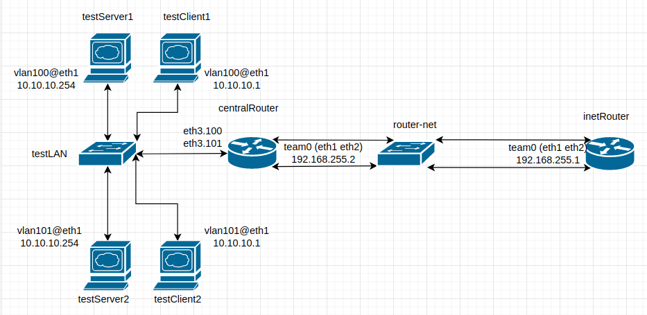
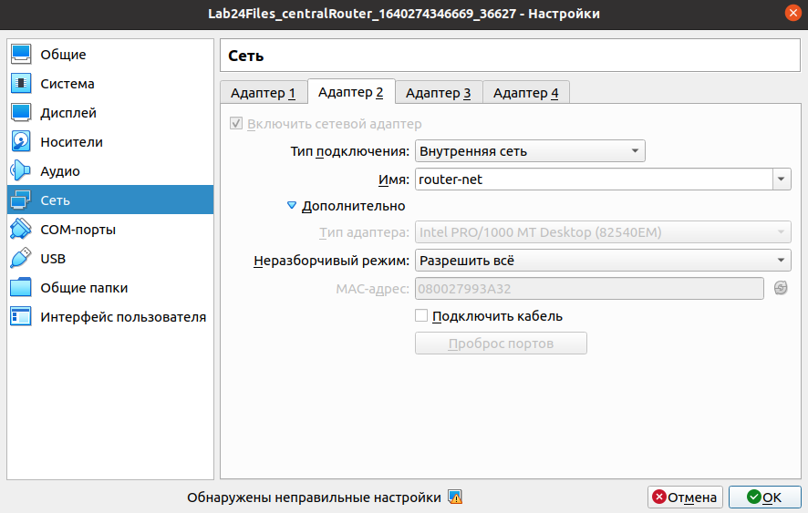

# **Введение** #

Цель данной лабораторной работы на практике ознакомиться с принципами работы VLAN, научиться использовать LACP. 

## **Описание** ##

Стенд состоит из шести серверов с ОС Centos 7:

- 'inetRouter'
- 'centralRouter'
- 'testServer1'
- 'testClient1'
- 'testServer2'
- 'testClient2'

Подключение серверов выполнено соглано схемы ниже:



Настройка NIC teaming на серверах 'inetRouter' и 'centralRouter' осуществляется утилитой nmcli. Этой же утилитой настраиваются VLAN интерфейсы на сервере 'centralRouter'. Настройка VLAN на серверах 'testServer1', 'testClient1', 'testServer2', 'testClient2' осуществляется созданием файлов с описанием подинтерфейсов VLAN в network-scripts. Таким образом при настройке стенда рассмотрены различные способы настройки VLAN.

Настройка интерфейсов осуществляется при старте стенда. Нам нужно проверить корректность настроек.

## **Хосты в сети testLAN** ##

Проверим доступность хостов в VLAN100 и VLAN101. Ожидается, что хосты с одинаковыми IP адресами, но в разных VLAN не будут мешать друг другу обмениваться пакетами с соседним хостом.

Проверим доступность 'testServer1' с 'testClient1':

```
[vagrant@testClient1 ~]$ ping 10.10.10.254
PING 10.10.10.254 (10.10.10.254) 56(84) bytes of data.
64 bytes from 10.10.10.254: icmp_seq=1 ttl=64 time=0.623 ms
64 bytes from 10.10.10.254: icmp_seq=2 ttl=64 time=2.11 ms
64 bytes from 10.10.10.254: icmp_seq=3 ttl=64 time=0.924 ms
64 bytes from 10.10.10.254: icmp_seq=4 ttl=64 time=0.555 ms
```

Пакеты на интерфейсе 'testServer1':

```
[vagrant@testServer1 ~]$ sudo tcpdump -nieth1 icmp
tcpdump: verbose output suppressed, use -v or -vv for full protocol decode
listening on eth1, link-type EN10MB (Ethernet), capture size 262144 bytes
09:04:21.476405 IP 10.10.10.1 > 10.10.10.254: ICMP echo request, id 4188, seq 1, length 64
09:04:21.476456 IP 10.10.10.254 > 10.10.10.1: ICMP echo reply, id 4188, seq 1, length 64
09:04:22.478606 IP 10.10.10.1 > 10.10.10.254: ICMP echo request, id 4188, seq 2, length 64
09:04:22.478674 IP 10.10.10.254 > 10.10.10.1: ICMP echo reply, id 4188, seq 2, length 64
09:04:23.480990 IP 10.10.10.1 > 10.10.10.254: ICMP echo request, id 4188, seq 3, length 64
09:04:23.481064 IP 10.10.10.254 > 10.10.10.1: ICMP echo reply, id 4188, seq 3, length 64
09:04:24.483025 IP 10.10.10.1 > 10.10.10.254: ICMP echo request, id 4188, seq 4, length 64
09:04:24.483066 IP 10.10.10.254 > 10.10.10.1: ICMP echo reply, id 4188, seq 4, length 64
```

Пакеты на интерфейсе 'testServer2':

```
[vagrant@testServer2 ~]$ sudo tcpdump -ieth1 icmp
tcpdump: verbose output suppressed, use -v or -vv for full protocol decode
listening on eth1, link-type EN10MB (Ethernet), capture size 262144 bytes
```

Из листингов видно, что на icmp пакеты сервера 'testClient1' отвечает сервер 'testServer1', как и ожидалось, поскольку они находятся в одном VLAN. Пакетов на интерфейсе 'testServer2' нет.

Проведём такую же проверку с сервера 'testClient2':

```
[vagrant@testClient2 ~]$ ping -c 5 10.10.10.254
PING 10.10.10.254 (10.10.10.254) 56(84) bytes of data.
64 bytes from 10.10.10.254: icmp_seq=1 ttl=64 time=0.794 ms
64 bytes from 10.10.10.254: icmp_seq=2 ttl=64 time=1.01 ms
64 bytes from 10.10.10.254: icmp_seq=3 ttl=64 time=0.994 ms
64 bytes from 10.10.10.254: icmp_seq=4 ttl=64 time=0.949 ms
64 bytes from 10.10.10.254: icmp_seq=5 ttl=64 time=0.625 ms

--- 10.10.10.254 ping statistics ---
5 packets transmitted, 5 received, 0% packet loss, time 4005ms
rtt min/avg/max/mdev = 0.625/0.875/1.017/0.152 ms
[vagrant@testClient2 ~]$
```

Пакеты на интерфейсе 'testServer2':

```
[vagrant@testServer2 ~]$ sudo tcpdump -ieth1 icmp
tcpdump: verbose output suppressed, use -v or -vv for full protocol decode
listening on eth1, link-type EN10MB (Ethernet), capture size 262144 bytes
10:14:47.960649 IP 10.10.10.1 > testServer2: ICMP echo request, id 23119, seq 1, length 64
10:14:47.960686 IP testServer2 > 10.10.10.1: ICMP echo reply, id 23119, seq 1, length 64
10:14:48.961260 IP 10.10.10.1 > testServer2: ICMP echo request, id 23119, seq 2, length 64
10:14:48.961344 IP testServer2 > 10.10.10.1: ICMP echo reply, id 23119, seq 2, length 64
10:14:49.962806 IP 10.10.10.1 > testServer2: ICMP echo request, id 23119, seq 3, length 64
10:14:49.962889 IP testServer2 > 10.10.10.1: ICMP echo reply, id 23119, seq 3, length 64
10:14:50.964332 IP 10.10.10.1 > testServer2: ICMP echo request, id 23119, seq 4, length 64
10:14:50.964403 IP testServer2 > 10.10.10.1: ICMP echo reply, id 23119, seq 4, length 64
10:14:51.965426 IP 10.10.10.1 > testServer2: ICMP echo request, id 23119, seq 5, length 64
10:14:51.965483 IP testServer2 > 10.10.10.1: ICMP echo reply, id 23119, seq 5, length 64
```

Пакеты на интерфейсе 'testServer1':

```
[vagrant@testServer1 ~]$ sudo tcpdump -nieth1 icmp
tcpdump: verbose output suppressed, use -v or -vv for full protocol decode
listening on eth1, link-type EN10MB (Ethernet), capture size 262144 bytes

```

Хосты находятся в разных VLAN и могут работать с одинаковыми IP адресами не мешая друг другу.
 

## **2 линка объединенные в Team** ##

На серверах 'inetRouter' и 'centralRouter' интерфейсы eth1 и eth2 объединенны в Team. Проверим настройку и работу технологии LACP. Для этого нам потребуется перевести адаптеры eth1 и eth2 виртуальных серверов 'inetRouter' и 'centralRouter' в неразборчивый (promiscuous) режим. Данная настройка осуществляется при запуске стенда, за это отвечают строки в Vagrant файле:

```
centralRouter.vm.provider "virtualbox" do |vb|
      vb.customize ["modifyvm", :id, "--nicpromisc2", "allow-all", "--nicpromisc3", "allow-all"]
    end
```

и в 'provision.yml':

```
command: ip link set eth1(2) promisc on
```

Информацию по настройкам интерфейса team получим с помощью утилиты  'teamdctl'.

Сервер 'inetRouter':

```
[vagrant@inetRouter ~]$ sudo teamdctl team0 state 
setup:
  runner: activebackup
ports:
  eth1
    link watches:
      link summary: up
      instance[link_watch_0]:
        name: ethtool
        link: up
        down count: 0
  eth2
    link watches:
      link summary: up
      instance[link_watch_0]:
        name: ethtool
        link: up
        down count: 0
runner:
  active port: eth1
```

Сервер 'centralRouter':

```
[vagrant@centralRouter ~]$ sudo teamdctl team0 state
setup:
  runner: activebackup
ports:
  eth1
    link watches:
      link summary: up
      instance[link_watch_0]:
        name: ethtool
        link: up
        down count: 0
  eth2
    link watches:
      link summary: up
      instance[link_watch_0]:
        name: ethtool
        link: up
        down count: 0
runner:
  active port: eth1
```

Из листинга видим, что все интерфейсы, которые включены в team, находятся в состоянии up. Активными на данный момент являются интерфейсы eth1 на обоих серверах.

Запустим ping на сервере 'inetRouter':

```
[vagrant@inetRouter ~]$ ip -bri a
lo               UNKNOWN        127.0.0.1/8 ::1/128 
eth0             UP             10.0.2.15/24 fe80::5054:ff:fe4d:77d3/64 
eth1             UP             
eth2             UP             
team0            UP             192.168.255.1/30 fe80::d301:6391:1a05:3024/64 
[vagrant@inetRouter ~]$ ping 192.168.255.2
PING 192.168.255.2 (192.168.255.2) 56(84) bytes of data.
64 bytes from 192.168.255.2: icmp_seq=1 ttl=64 time=0.364 ms
64 bytes from 192.168.255.2: icmp_seq=2 ttl=64 time=0.664 ms
64 bytes from 192.168.255.2: icmp_seq=3 ttl=64 time=0.569 ms
64 bytes from 192.168.255.2: icmp_seq=4 ttl=64 time=0.544 ms
64 bytes from 192.168.255.2: icmp_seq=5 ttl=64 time=0.877 ms
....

```

Из листинга ниже видно, что пакеты приходят только на активный интерфейс:

```
[vagrant@centralRouter ~]$ sudo tcpdump -ieth1 
tcpdump: verbose output suppressed, use -v or -vv for full protocol decode
listening on eth1, link-type EN10MB (Ethernet), capture size 262144 bytes
10:46:46.944493 IP 192.168.255.1 > centralRouter: ICMP echo request, id 23022, seq 1, length 64
10:46:46.944541 IP centralRouter > 192.168.255.1: ICMP echo reply, id 23022, seq 1, length 64
10:46:47.946677 IP 192.168.255.1 > centralRouter: ICMP echo request, id 23022, seq 2, length 64
10:46:47.946724 IP centralRouter > 192.168.255.1: ICMP echo reply, id 23022, seq 2, length 64
10:46:48.948097 IP 192.168.255.1 > centralRouter: ICMP echo request, id 23022, seq 3, length 64
10:46:48.948147 IP centralRouter > 192.168.255.1: ICMP echo reply, id 23022, seq 3, length 64
10:46:51.952974 ARP, Request who-has centralRouter tell 192.168.255.1, length 46

[vagrant@centralRouter ~]$ sudo tcpdump -ieth2
tcpdump: verbose output suppressed, use -v or -vv for full protocol decode
listening on eth2, link-type EN10MB (Ethernet), capture size 262144 bytes

```

Снова запустим ping и "выдернем" провод из интерфейса eth1 на сервере 'centralRouter':



Можно увидеть, что в момент отключения интерфейса была небольшая потеря пакетов (icmp_seq=20,21 потерялись):

```
[vagrant@inetRouter ~]$ ping 192.168.255.2
PING 192.168.255.2 (192.168.255.2) 56(84) bytes of data.
64 bytes from 192.168.255.2: icmp_seq=1 ttl=64 time=0.809 ms
64 bytes from 192.168.255.2: icmp_seq=2 ttl=64 time=0.885 ms
64 bytes from 192.168.255.2: icmp_seq=3 ttl=64 time=1.27 ms
64 bytes from 192.168.255.2: icmp_seq=4 ttl=64 time=1.39 ms
64 bytes from 192.168.255.2: icmp_seq=5 ttl=64 time=1.11 ms
64 bytes from 192.168.255.2: icmp_seq=6 ttl=64 time=0.805 ms
64 bytes from 192.168.255.2: icmp_seq=7 ttl=64 time=0.861 ms
64 bytes from 192.168.255.2: icmp_seq=8 ttl=64 time=0.715 ms
64 bytes from 192.168.255.2: icmp_seq=9 ttl=64 time=0.666 ms
64 bytes from 192.168.255.2: icmp_seq=10 ttl=64 time=0.898 ms
64 bytes from 192.168.255.2: icmp_seq=11 ttl=64 time=1.30 ms
64 bytes from 192.168.255.2: icmp_seq=12 ttl=64 time=0.932 ms
64 bytes from 192.168.255.2: icmp_seq=13 ttl=64 time=0.996 ms
64 bytes from 192.168.255.2: icmp_seq=14 ttl=64 time=1.40 ms
64 bytes from 192.168.255.2: icmp_seq=15 ttl=64 time=0.638 ms
64 bytes from 192.168.255.2: icmp_seq=16 ttl=64 time=0.974 ms
64 bytes from 192.168.255.2: icmp_seq=17 ttl=64 time=1.00 ms
64 bytes from 192.168.255.2: icmp_seq=18 ttl=64 time=1.10 ms
64 bytes from 192.168.255.2: icmp_seq=19 ttl=64 time=1.21 ms
64 bytes from 192.168.255.2: icmp_seq=22 ttl=64 time=1.12 ms
64 bytes from 192.168.255.2: icmp_seq=23 ttl=64 time=0.935 ms
64 bytes from 192.168.255.2: icmp_seq=24 ttl=64 time=0.849 ms
....
```

Статус team интерфейса на сервере 'centralRouter':

```
[vagrant@centralRouter ~]$ sudo teamdctl team0 state
setup:
  runner: activebackup
ports:
  eth1
    link watches:
      link summary: down
      instance[link_watch_0]:
        name: ethtool
        link: down
        down count: 2
  eth2
    link watches:
      link summary: up
      instance[link_watch_0]:
        name: ethtool
        link: up
        down count: 1
runner:
  active port: eth2
```

Из вывода можно увидеть, что интерфейс eth1 выключен, а активным стал интерфейс eth2.

Выключим и его:


```
[vagrant@centralRouter ~]$ sudo teamdctl team0 state
setup:
  runner: activebackup
ports:
  eth1
    link watches:
      link summary: down
      instance[link_watch_0]:
        name: ethtool
        link: down
        down count: 2
  eth2
    link watches:
      link summary: down
      instance[link_watch_0]:
        name: ethtool
        link: down
        down count: 2
runner:
  active port: 
```

Icmp пакеты остаются без ответа:

```
[vagrant@inetRouter ~]$ ping 192.168.255.2
PING 192.168.255.2 (192.168.255.2) 56(84) bytes of data.
64 bytes from 192.168.255.2: icmp_seq=1 ttl=64 time=0.716 ms
64 bytes from 192.168.255.2: icmp_seq=2 ttl=64 time=0.824 ms
64 bytes from 192.168.255.2: icmp_seq=3 ttl=64 time=0.909 ms
64 bytes from 192.168.255.2: icmp_seq=4 ttl=64 time=0.846 ms
64 bytes from 192.168.255.2: icmp_seq=5 ttl=64 time=0.975 ms
64 bytes from 192.168.255.2: icmp_seq=6 ttl=64 time=1.23 ms
64 bytes from 192.168.255.2: icmp_seq=7 ttl=64 time=1.02 ms
64 bytes from 192.168.255.2: icmp_seq=8 ttl=64 time=0.888 ms
64 bytes from 192.168.255.2: icmp_seq=9 ttl=64 time=0.570 ms
From 192.168.255.1 icmp_seq=39 Destination Host Unreachable
From 192.168.255.1 icmp_seq=40 Destination Host Unreachable
From 192.168.255.1 icmp_seq=41 Destination Host Unreachable
From 192.168.255.1 icmp_seq=42 Destination Host Unreachable
From 192.168.255.1 icmp_seq=43 Destination Host Unreachable
....
```

Включим обратно оба интерфейса:

```
[vagrant@centralRouter ~]$ sudo teamdctl team0 state
setup:
  runner: activebackup
ports:
  eth1
    link watches:
      link summary: up
      instance[link_watch_0]:
        name: ethtool
        link: up
        down count: 2
  eth2
    link watches:
      link summary: up
      instance[link_watch_0]:
        name: ethtool
        link: up
        down count: 2
runner:
  active port: eth1
```

Сервер 'centralRouter' cнова доступен с сервера 'inetRouter':

```
[vagrant@inetRouter ~]$ ping 192.168.255.2
PING 192.168.255.2 (192.168.255.2) 56(84) bytes of data.
64 bytes from 192.168.255.2: icmp_seq=1 ttl=64 time=0.979 ms
64 bytes from 192.168.255.2: icmp_seq=2 ttl=64 time=1.44 ms
64 bytes from 192.168.255.2: icmp_seq=3 ttl=64 time=1.36 ms
...
```


