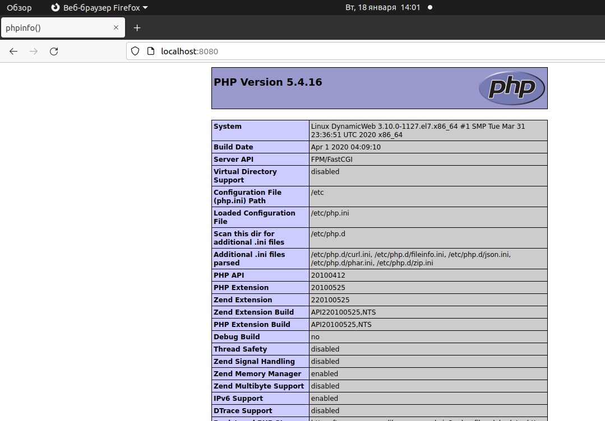
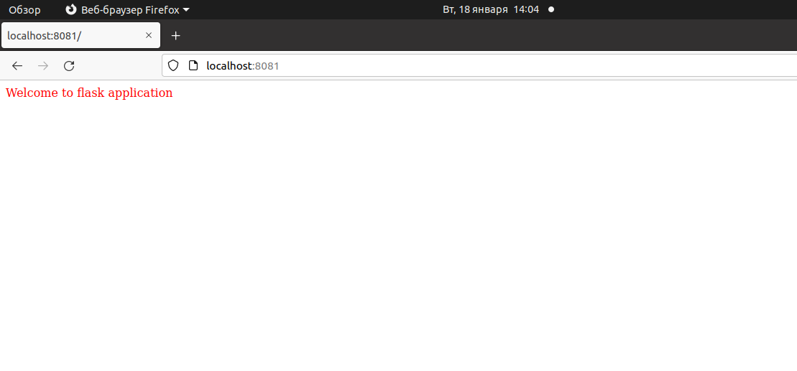
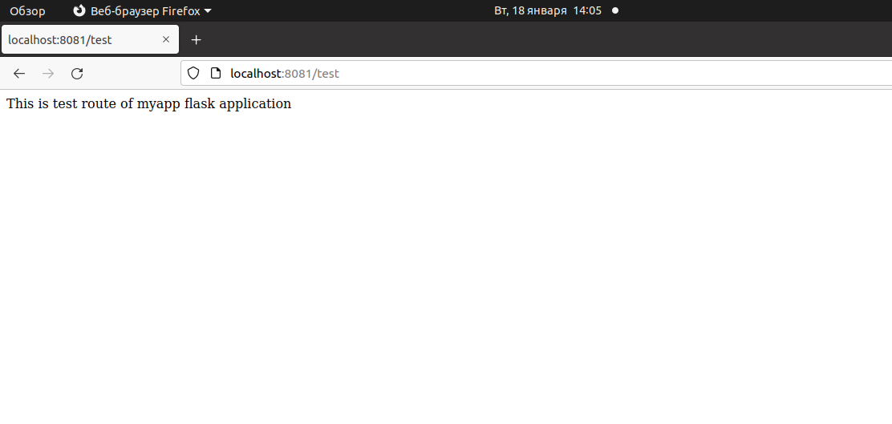
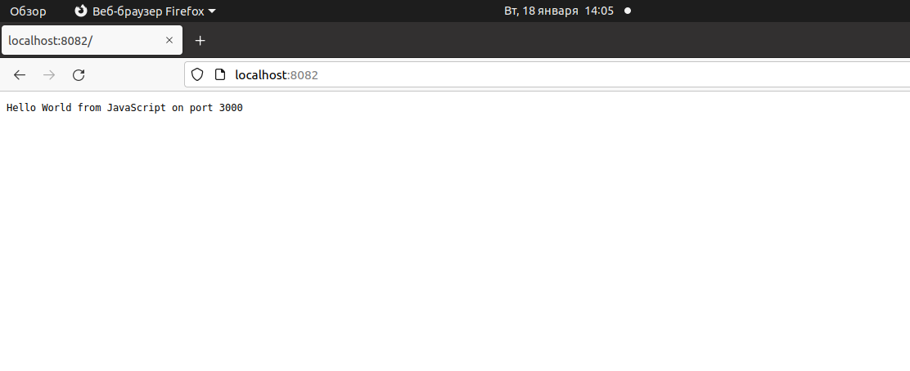

# **Введение** #

Цель данной лабораторной работы на практике разобраться в терминологии динамического Web. Настроить php_fpm, uwsgi, node.js

## **Описание** ##

При старте стенда разворачивается и настраивается виртуальная машина 'DynamicWeb' с ОС Centos 7. 
После запуска ожидается наличие сервисов приложений на портах:

- 9000 - php-fpm
- 3031 - uwsgi
- 3000 - node.js

Для сервисов созданы тестовые страницы, которые копируются при запуске стенда:

- 'test.php' - php-fpm
- 'myflaskapp.py' - uwsgi
- 'server.js' - node.js

## **Проверка работы** ##

Сайты приложений доступны через порты nginx, которые пробрасываются с виртуальной машины на хостовую.

- http://localhost:8080 - php-fpm
- http://localhost:8081 - uwsgi
- http://localhost:8082 - node.js

Попробуем подключиться на соответсвующие порты через браузер хостовой машины:

