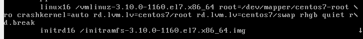
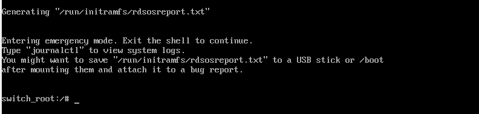
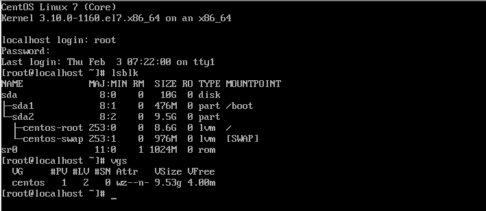
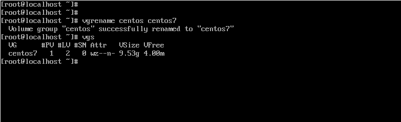
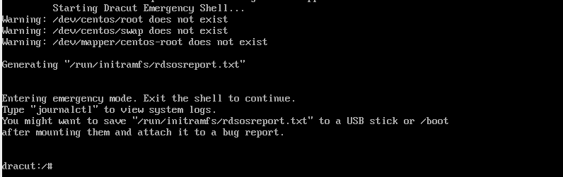
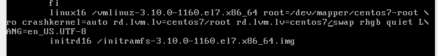
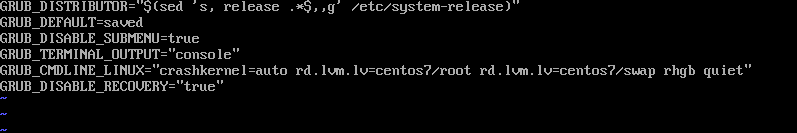
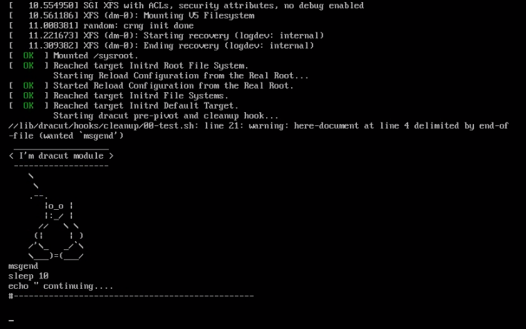

# **Введение**

Цель данной лабораторной работы изучить команды для конфигурирования grub2, научиться изменять порядок и параметры загрузки.

# **Попасть в систему без пароля несколькими способами.**

## *1. Параметр rd.break*

При появлении загрузочного меню нажимаем 'e' и редактируем строчку 'linux', в конце нужно добавить параметр rd.break:



И продолжим загрузку нажав Ctrl+x.



Для смены пароля нам необходимо перемонтировать нашу файловую систему в режиме rw:

```
mount -o remount,rw /sysroot
```

Сменить корневую файловую систему и сменить пароль:

```
chroot /sysroot
passwd
```

Для восстановления меток selinux нужно сделать autorelabel, создадим файл .autorelabel в корне файловой системы и перегрузимся:

```
touch /.autorelabel
exit
```
После восстановления меток система перегрузилась ещё раз и мы смогли залогиниться с новым паролем.

## *2. Параметр init=/sysroot/bin/sh*

В данном случае всё тоже, что и в первом варианте, кроме того, что параметр загрузки мы указываем не rd.break, а init=/sysroot/bin/sh после root=/dev/mapper/centos7-root ro. Если ro заменить на rw, то файловая система сразу смонтируется в режиме rw.

# **Установить систему с LVM, после чего переименовать VG**

Установим систему на виртуальную машину. VG называется centos:



Переименуем VG и перегрузимся:





Система не смогла загрузиться, т.к. не может найти VG с именем centos. Изменим параметры загрузки в меню и попробуем исправить ситуацию:



Изменили centos на centos7, система загрузилась.

Изменим имя VG в файле fstab и файле /etc/default/grub, в котором хранятся переменные для формирования grub.cfg, в частности переменную GRUB_CMDLINE_LINUX:



Перегенерируем конфиг grub и перегрузим систему:

```
grub2-mkconfig -o /boot/grub2/grub.cfg
```

В этот раз система загрузилась без ручной правки параметров загрузки.


# **Добавить модуль в initrd**

Создадим каталог для нашего модуля:

```
mkdir /usr/lib/dracut/modules.d/01test
```

Cам файл модуля module-setup.sh:

```
cat >module-setup.sh<<EOF

#------------------------------------------------
#!/bin/bash
 
check() {
     return 0 
} 
depends() {
     return 0 
} 
install() {
     inst_hook cleanup 00 "${moddir}/test.sh" 
} 
#------------------------------------------------
EOF

```

И файл test.sh, который нужно выполнить в модуле:

```
vi test.sh


#------------------------------------------------
#!/bin/bash 
exec 0<>/dev/console 1<>/dev/console 2<>/dev/console 
cat <<'msgend' 
 ___________________ 
< I'm dracut module > 
 ------------------- 
    \
     \ 
    .--. 
       |o_o | 
       |:_/ | 
      //   \ \ 
     (|     | ) 
    /'\_   _/`\ 
    \___)=(___/ 
msgend 
sleep 10 
echo " continuing....
#------------------------------------------------
```

Добавим права запуска обоим файлам:

```
chmod +x test.sh module-setup.sh
```

Создадим файл initramfs:

```
mkinitrd -f -v /boot/initramfs-$(uname -r).img $(uname -r)
```

И проверим наличие в нём наших изменений:

```
[root@localhost 01test]# lsinitrd -m /boot/initramfs-$(uname -r).img | grep test
test
[root@localhost 01test]#
```

При очередной загрузке можно увидеть выполнение нашего модуля:

